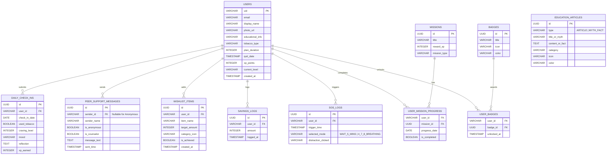

# Tobacco Awareness Application: Database Blueprint & ERD

This document provides a complete database specification for the **Tobacco Awareness Application**. It includes a visual Entity-Relationship Diagram (ERD), a detailed Data Dictionary, a standard Relational SQL (PostgreSQL) schema DDL, and a NoSQL Firebase Firestore schema mapping.

---

## 1. Entity-Relationship Diagram (ERD)

The diagram below maps all database entities, attributes, primary/foreign keys, and their relationships using Mermaid crow's foot notation.



---

## 2. Data Dictionary

### Table: `users`
Represents application users authenticated via Firebase Auth.
* **Fields:**
  * `uid` (VARCHAR, Primary Key): The unique identifier generated by Firebase Auth.
  * `email` (VARCHAR, Unique, Nullable): Email address of the user.
  * `display_name` (VARCHAR, Nullable): Profile name.
  * `photo_url` (VARCHAR, Nullable): Cloudinary URL of the profile image.
  * `educational_info` (VARCHAR, Nullable): User-entered education background.
  * `tobacco_type` (VARCHAR, Nullable): Type of tobacco used (e.g., `"সিগারেট"`, `"জর্দা/গুল"`, etc.).
  * `plan_duration` (INTEGER, Nullable): Duration of the quit plan in days (e.g., `7`, `14`, `30`).
  * `quit_date` (TIMESTAMP, Nullable): Scheduled date to start quitting.
  * `xp_points` (INTEGER, Default 0): Gamification experience points.
  * `current_level` (VARCHAR, Default 'Beginner'): Gamification level (e.g., `"Beginner"`, `"Warrior"`, `"Champion"`).
  * `created_at` (TIMESTAMP, Default NOW()): Account creation date.

### Table: `daily_check_ins`
Tracks users' daily tobacco use status, cravings, mood, and short logs.
* **Fields:**
  * `id` (UUID, Primary Key): Unique check-in ID.
  * `user_id` (VARCHAR, Foreign Key -> `users.uid`): The user who completed the check-in.
  * `check_in_date` (DATE): Date of the check-in.
  * `used_tobacco` (BOOLEAN): Whether tobacco was consumed.
  * `craving_level` (INTEGER): Intensity of craving (integer scale `1-10`).
  * `mood` (VARCHAR): User's mood (e.g., `"অসাধারণ"`, `"ভালো"`, etc.).
  * `reflection` (TEXT, Nullable): Optional text entry describing user reflections.
  * `xp_earned` (INTEGER, Default 10): Points awarded for completion.

### Table: `peer_support_messages`
Stores community and group chat room messages.
* **Fields:**
  * `id` (UUID, Primary Key): Unique message ID.
  * `sender_id` (VARCHAR, Foreign Key -> `users.uid`, Nullable): Sender ID; NULL if message is sent anonymously.
  * `sender_name` (VARCHAR): Display name of the sender, or `"অজ্ঞাত ব্যবহারকারী"` (Anonymous) if selected.
  * `is_anonymous` (BOOLEAN): Indicates if the sender chose to post anonymously.
  * `is_counselor` (BOOLEAN): Indicates if the sender is a verified peer counselor or administrator.
  * `message_text` (TEXT): Content of the chat message.
  * `sent_time` (TIMESTAMP): Time the message was sent.

### Table: `wishlist_items`
Tracks financial milestones ("আমার স্বপ্ন") configured in the Money Saver.
* **Fields:**
  * `id` (UUID, Primary Key): Unique item ID.
  * `user_id` (VARCHAR, Foreign Key -> `users.uid`): Owner of the wishlist.
  * `item_name` (VARCHAR): Name of the item (e.g., `"নতুন জুতো"`).
  * `target_amount` (INTEGER): Target saving cost in BDT.
  * `category_icon` (VARCHAR): Icon name (e.g., `"directions_walk"`, `"headphones"`).
  * `is_achieved` (BOOLEAN, Default FALSE): True if accumulated savings exceed or equal target.
  * `created_at` (TIMESTAMP): Date when the item was added.

### Table: `savings_logs`
Tracks the history of saved money entries.
* **Fields:**
  * `id` (UUID, Primary Key): Unique entry ID.
  * `user_id` (VARCHAR, Foreign Key -> `users.uid`): User who added savings.
  * `amount` (INTEGER): Saved amount in BDT.
  * `logged_at` (TIMESTAMP): Date and time of logging.

### Table: `missions`
Definitions for daily and achievements-related gamification quests.
* **Fields:**
  * `id` (UUID, Primary Key): Unique mission ID.
  * `title` (VARCHAR): Title of the mission.
  * `reward_xp` (INTEGER): XP rewarded upon completion.
  * `mission_type` (VARCHAR): Type category (e.g., `"DAILY"`, `"STREAK"`).

### Table: `user_mission_progress`
Junction table tracking user daily mission completion.
* **Fields:**
  * `user_id` (VARCHAR, Foreign Key -> `users.uid`, Composite PK): User ID.
  * `mission_id` (UUID, Foreign Key -> `missions.id`, Composite PK): Mission ID.
  * `progress_date` (DATE, Composite PK): Date of progress/completion.
  * `is_completed` (BOOLEAN, Default FALSE): Status.

### Table: `badges`
Milestones and accomplishments unlocked by users.
* **Fields:**
  * `id` (UUID, Primary Key): Unique badge ID.
  * `title` (VARCHAR): Name of the badge (e.g., `"৩ দিনের যোদ্ধা"`).
  * `icon` (VARCHAR): Icon identifier.
  * `color` (VARCHAR): Hexadecimal color code representing the badge frame.

### Table: `user_badges`
Junction table tracking unlocked user badges.
* **Fields:**
  * `user_id` (VARCHAR, Foreign Key -> `users.uid`, Composite PK): User ID.
  * `badge_id` (UUID, Foreign Key -> `badges.id`, Composite PK): Badge ID.
  * `unlocked_at` (TIMESTAMP): Time of unlocking.

### Table: `education_articles`
Awareness blogs, articles, and Myth vs Fact entries.
* **Fields:**
  * `id` (UUID, Primary Key): Unique educational ID.
  * `type` (VARCHAR): Either `"ARTICLE"` or `"MYTH_FACT"`.
  * `title_or_myth` (VARCHAR): Title of the article or text of the myth.
  * `content_or_fact` (TEXT): Core content or the true scientific fact.
  * `category` (VARCHAR, Nullable): Category classification (e.g., `"আর্থিক ক্ষতি"`).
  * `icon` (VARCHAR, Nullable): Material Icon name.
  * `color` (VARCHAR, Nullable): Visual category color representation.

### Table: `sos_logs`
Logs instances of cravings and which distraction/coping mechanisms were used.
* **Fields:**
  * `id` (UUID, Primary Key): Unique log ID.
  * `user_id` (VARCHAR, Foreign Key -> `users.uid`): User executing the SOS.
  * `trigger_time` (TIMESTAMP): Date and time of trigger.
  * `selected_mode` (VARCHAR): Chosen action (`"WAIT_5_MINS"` or `"4_7_8_BREATHING"`).
  * `distraction_clicked` (VARCHAR, Nullable): Distraction selected, if any (`"WATER"`, `"FRIEND"`, `"WALK"`).

---

## 3. Relational SQL Schema (PostgreSQL DDL)

Here is the SQL script to generate the relational model schema with all keys, constraints, and default behaviors:

```sql
-- Enable UUID extension if needed
CREATE EXTENSION IF NOT EXISTS "uuid-ossp";

-- Table: users
CREATE TABLE users (
    uid VARCHAR(128) PRIMARY KEY,
    email VARCHAR(255) UNIQUE,
    display_name VARCHAR(100),
    photo_url VARCHAR(500),
    educational_info VARCHAR(255),
    tobacco_type VARCHAR(100),
    plan_duration INTEGER CHECK (plan_duration IN (7, 14, 30)),
    quit_date TIMESTAMP,
    xp_points INTEGER DEFAULT 0 CHECK (xp_points >= 0),
    current_level VARCHAR(50) DEFAULT 'Beginner',
    created_at TIMESTAMP DEFAULT CURRENT_TIMESTAMP
);

-- Table: daily_check_ins
CREATE TABLE daily_check_ins (
    id UUID PRIMARY KEY DEFAULT uuid_generate_v4(),
    user_id VARCHAR(128) NOT NULL REFERENCES users(uid) ON DELETE CASCADE,
    check_in_date DATE NOT NULL,
    used_tobacco BOOLEAN NOT NULL,
    craving_level INTEGER NOT NULL CHECK (craving_level BETWEEN 1 AND 10),
    mood VARCHAR(50) NOT NULL,
    reflection TEXT,
    xp_earned INTEGER DEFAULT 10,
    CONSTRAINT unique_user_daily_check_in UNIQUE (user_id, check_in_date)
);

-- Table: peer_support_messages
CREATE TABLE peer_support_messages (
    id UUID PRIMARY KEY DEFAULT uuid_generate_v4(),
    sender_id VARCHAR(128) REFERENCES users(uid) ON DELETE SET NULL,
    sender_name VARCHAR(100) NOT NULL DEFAULT 'অজ্ঞাত ব্যবহারকারী',
    is_anonymous BOOLEAN NOT NULL DEFAULT FALSE,
    is_counselor BOOLEAN NOT NULL DEFAULT FALSE,
    message_text TEXT NOT NULL,
    sent_time TIMESTAMP DEFAULT CURRENT_TIMESTAMP
);

-- Table: wishlist_items
CREATE TABLE wishlist_items (
    id UUID PRIMARY KEY DEFAULT uuid_generate_v4(),
    user_id VARCHAR(128) NOT NULL REFERENCES users(uid) ON DELETE CASCADE,
    item_name VARCHAR(150) NOT NULL,
    target_amount INTEGER NOT NULL CHECK (target_amount > 0),
    category_icon VARCHAR(50) NOT NULL,
    is_achieved BOOLEAN NOT NULL DEFAULT FALSE,
    created_at TIMESTAMP DEFAULT CURRENT_TIMESTAMP
);

-- Table: savings_logs
CREATE TABLE savings_logs (
    id UUID PRIMARY KEY DEFAULT uuid_generate_v4(),
    user_id VARCHAR(128) NOT NULL REFERENCES users(uid) ON DELETE CASCADE,
    amount INTEGER NOT NULL CHECK (amount > 0),
    logged_at TIMESTAMP DEFAULT CURRENT_TIMESTAMP
);

-- Table: missions
CREATE TABLE missions (
    id UUID PRIMARY KEY DEFAULT uuid_generate_v4(),
    title VARCHAR(255) NOT NULL,
    reward_xp INTEGER NOT NULL CHECK (reward_xp >= 0),
    mission_type VARCHAR(50) NOT NULL CHECK (mission_type IN ('DAILY', 'STREAK', 'ONBOARDING'))
);

-- Table: user_mission_progress
CREATE TABLE user_mission_progress (
    user_id VARCHAR(128) NOT NULL REFERENCES users(uid) ON DELETE CASCADE,
    mission_id UUID NOT NULL REFERENCES missions(id) ON DELETE CASCADE,
    progress_date DATE NOT NULL,
    is_completed BOOLEAN NOT NULL DEFAULT FALSE,
    PRIMARY KEY (user_id, mission_id, progress_date)
);

-- Table: badges
CREATE TABLE badges (
    id UUID PRIMARY KEY DEFAULT uuid_generate_v4(),
    title VARCHAR(100) NOT NULL UNIQUE,
    icon VARCHAR(50) NOT NULL,
    color VARCHAR(10) NOT NULL
);

-- Table: user_badges
CREATE TABLE user_badges (
    user_id VARCHAR(128) NOT NULL REFERENCES users(uid) ON DELETE CASCADE,
    badge_id UUID NOT NULL REFERENCES badges(id) ON DELETE CASCADE,
    unlocked_at TIMESTAMP DEFAULT CURRENT_TIMESTAMP,
    PRIMARY KEY (user_id, badge_id)
);

-- Table: education_articles
CREATE TABLE education_articles (
    id UUID PRIMARY KEY DEFAULT uuid_generate_v4(),
    type VARCHAR(20) NOT NULL CHECK (type IN ('ARTICLE', 'MYTH_FACT')),
    title_or_myth VARCHAR(255) NOT NULL,
    content_or_fact TEXT NOT NULL,
    category VARCHAR(100),
    icon VARCHAR(50),
    color VARCHAR(10)
);

-- Table: sos_logs
CREATE TABLE sos_logs (
    id UUID PRIMARY KEY DEFAULT uuid_generate_v4(),
    user_id VARCHAR(128) NOT NULL REFERENCES users(uid) ON DELETE CASCADE,
    trigger_time TIMESTAMP DEFAULT CURRENT_TIMESTAMP,
    selected_mode VARCHAR(50) NOT NULL CHECK (selected_mode IN ('WAIT_5_MINS', '4_7_8_BREATHING')),
    distraction_clicked VARCHAR(50) CHECK (distraction_clicked IN ('WATER', 'FRIEND', 'WALK'))
);

-- Create Indexes for optimization
CREATE INDEX idx_checkins_user_date ON daily_check_ins(user_id, check_in_date);
CREATE INDEX idx_messages_sent_time ON peer_support_messages(sent_time);
CREATE INDEX idx_wishlist_user ON wishlist_items(user_id);
CREATE INDEX idx_savings_user ON savings_logs(user_id);
CREATE INDEX idx_sos_user_time ON sos_logs(user_id, trigger_time);
```

---

## 4. Firebase Firestore Schema (NoSQL Blueprint)

Since the application runs on **Firebase** using Firebase Auth, this represents the standard blueprint mapping the schema into Firestore's document-collection structure.

### Root Collections and Documents

```
/users (Collection)
  └─ {uid} (Document)
       ├─ email: "user@example.com"
       ├─ displayName: "Ariful Islam"
       ├─ photoUrl: "https://res.cloudinary.com/...image.jpg"
       ├─ educationalInfo: "University"
       ├─ tobaccoType: "সিগারেট"
       ├─ planDuration: 30
       ├─ quitDate: Timestamp
       ├─ xpPoints: 1250
       ├─ currentLevel: "Warrior"
       ├─ totalSavings: 450
       ├─ createdAt: Timestamp
       │
       ├─ /checkIns (Subcollection)
       │    └─ {checkInId} (Document)
       │         ├─ date: Date
       │         ├─ usedTobacco: false
       │         ├─ cravingLevel: 5
       │         ├─ mood: "ভালো"
       │         ├─ reflection: "আজকের দিনটি ভালো ছিল।"
       │         └─ xpEarned: 10
       │
       ├─ /wishlist (Subcollection)
       │    └─ {itemId} (Document)
       │         ├─ itemName: "নতুন জুতো"
       │         ├─ targetAmount: 3500
       │         ├─ categoryIcon: "directions_walk"
       │         ├─ isAchieved: false
       │         └─ createdAt: Timestamp
       │
       ├─ /savingsLogs (Subcollection)
       │    └─ {logId} (Document)
       │         ├─ amount: 50
       │         └─ loggedAt: Timestamp
       │
       ├─ /unlockedBadges (Subcollection)
       │    └─ {badgeId} (Document)
       │         ├─ badgeTitle: "৩ দিনের যোদ্ধা"
       │         ├─ icon: "shield"
       │         ├─ color: "0xFF4CAF50"
       │         └─ unlockedAt: Timestamp
       │
       └─ /sosLogs (Subcollection)
            └─ {logId} (Document)
                 ├─ triggerTime: Timestamp
                 ├─ selectedMode: "4_7_8_BREATHING"
                 └─ distractionClicked: "WATER"

/peerSupportMessages (Collection)
  └─ {messageId} (Document)
       ├─ senderId: "uid_string"  // or null if anonymous
       ├─ senderName: "রাকিব হোসেন"
       ├─ isAnonymous: false
       ├─ isCounselor: false
       ├─ messageText: "অভিনন্দন ভাই! আমার কেবল দ্বিতীয় দিন।"
       └─ sentTime: Timestamp

/missions (Collection)
  └─ {missionId} (Document)
       ├─ title: "দৈনিক চেক-ইন সম্পন্ন করুন"
       ├─ rewardXp: 10
       └─ missionType: "DAILY"

/educationArticles (Collection)
  └─ {articleId} (Document)
       ├─ type: "MYTH_FACT"
       ├─ titleOrMyth: "ই-সিগারেট বা ভ্যাপিং সম্পূর্ণ নিরাপদ।"
       ├─ contentOrFact: "ভুল! ই-সিগারেটেও নিকোটিন থাকে..."
       ├─ category: "ফুসফুস ও হৃদরোগ"
       ├─ icon: "cancel"
       └─ color: "0xFFE57373"
```
